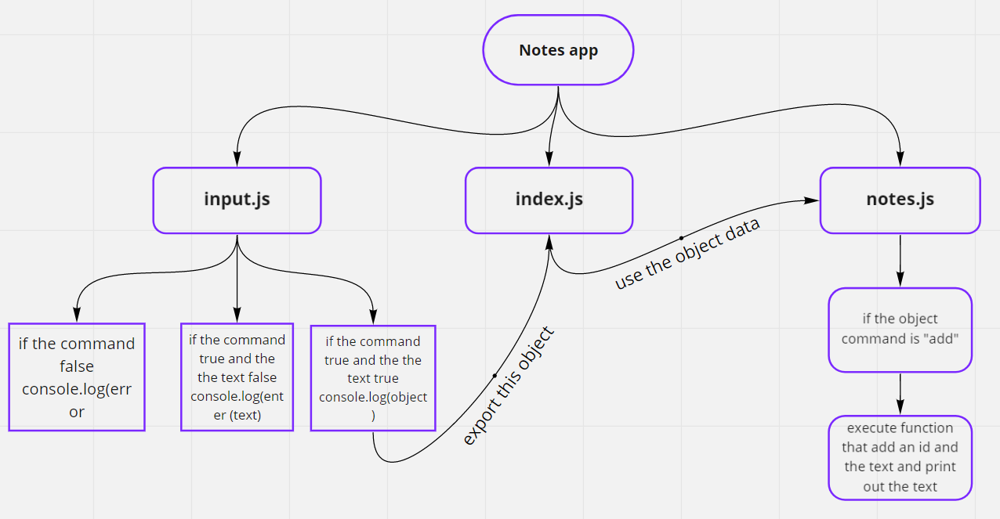
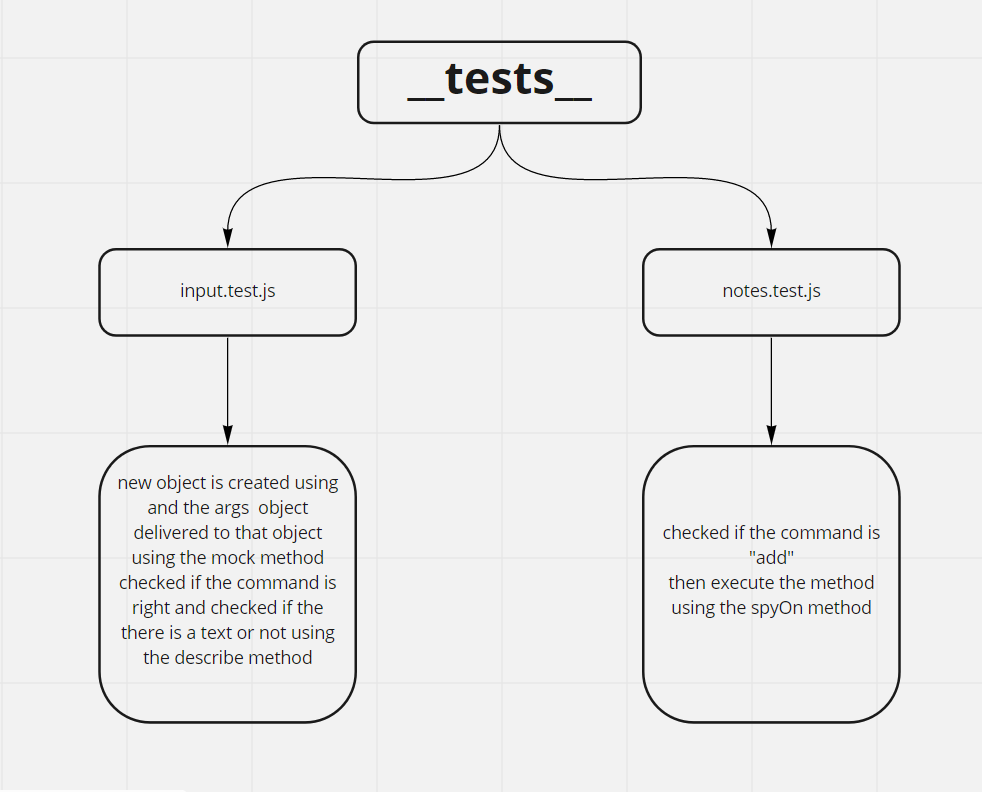
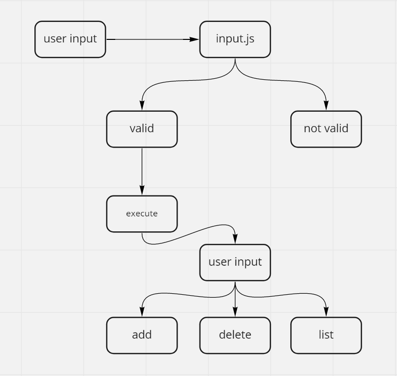

# notes
## cli app

## class-01

**the idea from this lab is to create a cli app and add notes to it**

*this app is created based on the refactring model, so the index.js fils is the main file that recive the exported data from other files*

*a constructor and two prototype functions are used to check for the command and the data that inserted by the user*

*another constructor and two prototype functions are used to accept the data and print it out as required*




## class-02

*a test implemented using the jest laibrary to ensure that the app is working*





## class-03
**Notesy is a Command Line Interface package that gives the ability to take notes.**

### Commands for Adding Text
- We start by typing node .
- To save text one of two commands can be used.
```
-add
```
- Next we can type our text and hit enter to save.
```
The above step combined will look something like this.
node . -add 'Save some text'
```
### Dependencies
```
* npm init
* npm install minimist 
* npm install --save-dev jest
```


